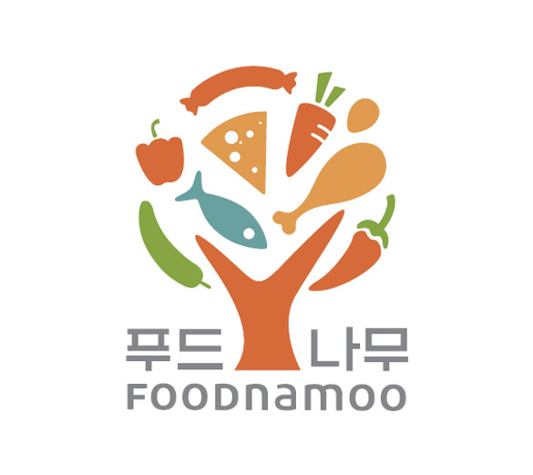

# 이력서

## 소개


- 이름: 김지훈
- 군필여부: 병장 만기전역
- 취미: 수영, 드라이브, 여행, 독서, 기술자료수집
- Email: rlatkrnjs1@gmail.com
- GitHub: [github.com/Jihunkim95](https://github.com/Jihunkim95)
- Velog:https://velog.io/@darak551/series
- Instagram: [instagram.com/wwwwji95/](https://www.instagram.com/wwwwji95/)

```
규칙적인 생활을 바탕으로 주도적으로 살아가며, 문제해결 능력을 키워 개발자가 되는것이 꿈입니다.
```


## 회사경력
- [에프엔블럭] ERP개발 / HR모듈 담당 (2021.02 ~ 2023.08)


## 대외활동
- TECHIT IOS3기 (2023.09 ~)


## 교내활동
- 캡스톤디자인 트리즈 발명원리를 이용한 타월 개발 (2020.03~2020.06)
- Visual Basic를 활용한 업무 프로세스 데이터 모델링 및 개발 (2018.09~2018.12)
- SPSS를 활용한 인공지능 스피커 고객만족도 분석(2018.9 ~ 2018.12)
- MINITAB을 활용한 신뢰성 분석(2015.03 ~ 2015.07)
  
## 봉사활동
- 김장 자원봉사 (2018.11)
- 환경정화 (2016.02)
- 미취학 아동 진로적성 교육활동(2014)
- 경로당 이미용 봉사 (2014)
- 범죄예방 캠페인(2014)
- 구세군 활동 (2013)
  
## 학력
- 메타버스테크놀로지 공학 석사 (2025.02~)
- 산업공학과 학사 졸업 (2014.02 ~ 2021.02)
- 호원고등학교 졸업(2011 ~ 2013)

## 사용 기술

### Backend
테이블 설계, 암호화, Store Procedure를 활용한 데이터호출 및 쿼리작성이 가능합니다
- MSSQL
- SSMS

### Frontend
사내 상용화된 템플릿으로 화면 개발 및 API연동이 가능합니다.
-  TypeScrpit
-  Angular

그 외 흔히 채용공고에 나오는 이런 '자격요건'들을 경험 해봤습니다.
- 팀 : 기능조직
- 이슈관리 : SVN / Github
- FTP : FileZilla
- 버전관리 : SVN / GIT
## 프로젝트 이력



### 중도정산 개발
- 소개: 퇴직자를 위한 연말정산 개발
- 기간: 2023.04 ~ 2023.08
- 역활: 테이블 설계, 화면 디자인 및 개발
- 프로젝트 : 영림원소프트랩 구조를 토대로 퇴사자 인적정보 및 소득을 기반으로한 중도정산 서비스 고도화
- 결과: 연말정산 서비스를 위한 기반설계
- 관련기술 : MSSQL, Typescript


### 블럭스니펫
- 소개 : 사내 업무용 스니펫 개발
- 사이드 프로젝트로 3명 개발
- 역활 : 자료정리, 유지보수, 신규기능개발
- 기간 : 2022.11 ~ 2023.01
- 관련기술 : MSSQL, Typescript, Json


### 짱구는못말려 푸딩 슈팅게임

- 소개: 훈이로부터 푸딩을 지켜내는 짱구 슈팅게임
- 기간: 2023.04 ~ 2023.04
- 역할: 개인프로젝트 기능 개발 및 유지보수
- 관련기술: javascrpit
- https://jjanggupudding.netlify.app


## 수상 경력

- 한국품질경영학회/공모전 창고재고관리의 대한 문제점 및 해결방안 논문 아이디어상(2018.10)

## 자격증

- SQLD
- ERP정보관리사 생산 1급
- ERP정보관리사 물류 1급
- 6시그마 GreenBelt
